# Frappe Assistant Core

🔧 **LLM Integration Platform for ERPNext** - Give any Large Language Model the power to interact with your ERPNext system through standardized tools and protocols.

---

## 🌟 What is Frappe Assistant Core?

**Infrastructure that connects LLMs to ERPNext.** Frappe Assistant Core works with the Model Context Protocol (MCP) to expose ERPNext functionality to any compatible Language Model, enabling:

- **🔌 LLM-Agnostic Integration**: Works with Claude, GPT, custom models, or any MCP-compatible system
- **📁 One-Click Claude Setup**: Generate DXT files for instant Claude Desktop integration  
- **🔒 Enterprise Security**: ERPNext permissions, audit logging, and role-based access control
- **🛠️ 20+ Built-in Tools**: Document operations, search, reporting, analytics, and visualization
- **🚀 Plugin Architecture**: Extensible framework for custom business logic and integrations
- **🆓 Open Source**: AGPL-3.0 licensed - transparent, community-driven development

---

## ⚡ Quick Installation

Get up and running in 3 steps:

```bash
# 1. Get the app
cd frappe-bench
bench get-app https://github.com/buildswithpaul/Frappe_Assistant_Core

# 2. Install on your site  
bench --site [site-name] install-app frappe_assistant_core

```

**That's it!** Your ERPNext system is now accessible to any MCP-compatible LLM.

---

## 🎯 Core Components

### 🔧 **MCP Server Infrastructure**
Robust protocol handler that exposes ERPNext functionality through standardized tools.

### 📦 **Client Integration Packages** 
Ready-to-use integrations including DXT file generation for Claude Desktop setup.

### 🛠️ **21 Built-in Tools**
Document CRUD, search, reporting, analytics, Python execution, and visualization capabilities.


*Comprehensive tool set for complete ERPNext integration*

### 🔌 **Plugin Architecture**
Extensible framework for custom tools, external app integration, and business-specific logic.


*Professional admin interface for plugin management and configuration*

### 🔐 **OAuth 2.0 / OIDC Authentication**
Full OAuth 2.0 and OpenID Connect implementation with Dynamic Client Registration (RFC 7591), PKCE support, and standardized discovery endpoints for seamless integration with MCP Inspector and third-party tools.

### 🔒 **Enterprise Security Layer**
Authentication, ERPNext permissions integration, audit logging, and role-based access.


*Complete audit logging tracks all LLM interactions with your ERP data*

### 🌐 **LLM-Agnostic Design**
Compatible with any MCP-enabled system - not locked to specific AI providers.

### Architecture Overview


## Data Flow Architecture


## Plugin Architecture Detail

```mermaid
graph LR
    subgraph "External Apps"
        App1[Custom Frappe App]
        App2[Industry-Specific App]
        App3[Third-Party App]
    end
    
    subgraph "Tool Discovery"
        Hooks[hooks.py<br/>assistant_tools]
        Scanner[Plugin Scanner]
        Registry[Tool Registry]
    end
    
    subgraph "Core Plugins"
        CoreP[Core Plugin<br/>Document Operations]
        DataP[Data Science Plugin<br/>Python Execution]
        VizP[Visualization Plugin<br/>Charts & Dashboards]
    end
    
    subgraph "Runtime Management"
        Manager[Plugin Manager]
        Config[Plugin Configuration]
        State[Enable/Disable State]
    end

    App1 --> Hooks
    App2 --> Hooks  
    App3 --> Hooks
    
    Hooks --> Scanner
    Scanner --> Registry
    
    CoreP --> Registry
    DataP --> Registry
    VizP --> Registry
    
    Registry --> Manager
    Manager --> Config
    Manager --> State

    classDef external fill:#e3f2fd,stroke:#1976d2,stroke-width:2px
    classDef discovery fill:#f1f8e9,stroke:#388e3c,stroke-width:2px
    classDef plugins fill:#fff8e1,stroke:#f57f17,stroke-width:2px
    classDef management fill:#fce4ec,stroke:#c2185b,stroke-width:2px

    class App1,App2,App3 external
    class Hooks,Scanner,Registry discovery
    class CoreP,DataP,VizP plugins
    class Manager,Config,State management
```



## Security & Permissions Flow


## Integration Patterns


*Plugin-based architecture supports any MCP-compatible LLM*

---

## 🚀 Getting Started

Ready to connect your LLM to ERPNext? Follow these simple steps:

### Step 1: Get Your MCP Endpoint URL

1. **Open FAC Admin Page**
   - After installation, go to: **Desk → Tools → FAC Admin**
   - Or navigate directly to: `https://your-site.com/app/fac-admin`

2. **Copy Your MCP Endpoint**
   - On the FAC Admin page, you'll see your **MCP Endpoint URL**
   - It looks like: `https://your-site.com/api/method/frappe_assistant_core.api.fac_endpoint.handle_mcp`
   - Copy this URL - you'll need it in the next step


*Get your MCP endpoint URL from the FAC Admin page*

### Step 2: Add MCP Server to Your LLM

Choose your LLM platform and follow the instructions:

#### 🔷 **Claude Desktop** (Recommended)

1. **In Claude Desktop**, click the settings icon (⚙️) in the bottom left
2. Click **"Connectors"**
3. Click **"+ Add Custom Connector""** button
4. Fill in the details:
   - **Name**: `Frappe Assistant Core` (or any name you prefer)
   - **URL**: Paste your MCP endpoint URL from Step 1
5. Click **"Add"**


#### 🟢 **ChatGPT** (Plus Users Only)

> **Note**: Custom connectors are only available for ChatGPT Plus and above plan users with Developer Mode enabled

1. **In ChatGPT**, open the side panel
2. Go to **Connectors** menu
3. Click **"Create"** button
4. Fill in the connector details:
   - **Name**: `Frappe Assistant Core` (or any name you prefer)
   - **URL**: Paste your MCP endpoint URL from Step 1
5. Click **"Create"**


#### 🌐 **Claude Web** (claude.ai)

1. **On Claude Web**, click your profile icon
2. Go to **Settings → Integrations**
3. Click **"Add Custom Connector"**
4. Fill in:
   - **Name**: `Frappe Assistant`
   - **URL**: Paste your MCP endpoint URL from Step 1
5. Click **"Add"**

### Step 3: Authenticate & Connect

1. **Click "Connect"** in your LLM client
2. **You'll be redirected** to your Frappe login page
3. **Login** with your Frappe username and password
4. **Click "Authenticate"** to authorize the LLM to access your ERPNext data
5. **Done!** You'll be redirected back to your LLM


*Secure OAuth 2.0 authentication - login once, access anytime*

### Step 4: Start Using Your Tools!

Your LLM can now access ERPNext! Try these commands:

> "List all customers in the system"

> "Create a new customer called Acme Corp with email test@acme.com"

> "Show me this month's sales report"

> "What are the top 5 selling items?"

---

### 🧪 For Developers: MCP Inspector Testing

Want to test and debug your MCP server? Use the MCP Inspector tool:

**1. Enable CORS for Local Testing**

Add to your `site_config.json`:
```json
{
  "oauth_cors_allowed_origins": "*"
}
```

Or in **Assistant Core Settings** → OAuth tab → **Allowed Public Client Origins**: `http://localhost:6274`

**2. Open MCP Inspector**

- Go to: http://localhost:6274/
- Select **"Streamable HTTP"** transport
- Enter your **MCP Endpoint URL** from FAC Admin
- Click **"Guided OAuth Flow"** and click **Continue** for each step
- Login when prompted

**3. Test Tools**

- Browse available tools
- Execute test calls
- Debug request/response data
- Monitor OAuth token flow


*MCP Inspector provides visual testing and debugging for developers*

---

### 📚 Advanced Integration

For custom applications, advanced OAuth flows, or programmatic integration, see our comprehensive guides:

- **[MCP StreamableHTTP Guide](docs/architecture/MCP_STREAMABLEHTTP_GUIDE.md)** - Complete OAuth + MCP implementation
- **[OAuth Setup Guide](docs/getting-started/oauth/oauth_setup_guide.md)** - Detailed OAuth configuration
- **[API Reference](docs/api/API_REFERENCE.md)** - All endpoints and protocols
- **[Development Guide](docs/development/DEVELOPMENT_GUIDE.md)** - Build custom integrations

---

## 📚 Documentation

**[📖 Complete Documentation Index](docs/README.md)** - Browse all documentation organized by category

### 🚀 Quick Start Guides
| Guide | Description |
|-------|-------------|
| [Getting Started](docs/getting-started/GETTING_STARTED.md) | Complete setup guide for new users |
| [Claude Desktop Quick Start](docs/getting-started/QUICK_START_CLAUDE_DESKTOP.md) | Connect Claude Desktop in 5 minutes |
| [Migration Guide](docs/getting-started/MIGRATION_GUIDE.md) | **New!** Migrate from STDIO to OAuth |
| [OAuth Quick Start](docs/getting-started/oauth/oauth_quick_start.md) | OAuth 2.0 setup in 2 minutes |

### 🏗️ Architecture & Technical
| Guide | Description |
|-------|-------------|
| [Architecture Overview](docs/architecture/ARCHITECTURE.md) | System design and plugin architecture |
| [MCP StreamableHTTP Guide](docs/architecture/MCP_STREAMABLEHTTP_GUIDE.md) | **New!** OAuth + StreamableHTTP integration |
| [Technical Documentation](docs/architecture/TECHNICAL_DOCUMENTATION.md) | Complete technical reference |
| [Performance Guide](docs/architecture/PERFORMANCE.md) | Optimization and monitoring |

### 📖 API Reference
| Guide | Description |
|-------|-------------|
| [API Reference](docs/api/API_REFERENCE.md) | MCP protocol endpoints and OAuth APIs |
| [Tool Reference](docs/api/TOOL_REFERENCE.md) | Complete catalog of all 21 available tools |
| [OAuth Setup Guide](docs/getting-started/oauth/oauth_setup_guide.md) | Comprehensive OAuth configuration |

### 🛠️ Development
| Guide | Description |
|-------|-------------|
| [Development Guide](docs/development/DEVELOPMENT_GUIDE.md) | Create custom tools and plugins |
| [External App Development](docs/development/EXTERNAL_APP_DEVELOPMENT.md) | Tools in your Frappe apps (recommended) |
| [Plugin Development](docs/development/PLUGIN_DEVELOPMENT.md) | Build internal plugins |
| [Test Case Creation](docs/development/TEST_CASE_CREATION_GUIDE.md) | Testing patterns and best practices |

---

## 🏢 Integration Scenarios

- **Business Users + Claude**: Natural language ERP operations through Claude Desktop
- **Developers + Custom LLMs**: Build AI-powered business applications with ERPNext data
- **System Integrators**: Deploy LLM-ERP solutions for clients across industries
- **AI Companies**: Add ERPNext capabilities to existing AI products and services
- **Enterprise Teams**: Create department-specific AI tools with custom plugins

---

## 🌟 Why Choose Frappe Assistant Core?

✅ **LLM-Agnostic** - Not locked to any specific AI provider or model  
✅ **Production Ready** - Enterprise-grade security, permissions, and audit logging  
✅ **One-Click Setup** - DXT file generation for instant Claude Desktop integration  
✅ **20+ Built-in Tools** - Comprehensive ERPNext functionality out of the box  
✅ **Plugin Architecture** - Unlimited extensibility for custom business logic  
✅ **Open Source** - AGPL-3.0 licensed with transparent, community-driven development  

---

## 🤝 Contributing

We welcome contributions! This is an open source project under AGPL-3.0.

1. Fork the repository
2. Create a feature branch  
3. Add tests for new functionality
4. Submit a pull request

See [Contributing Guidelines](Contributing.md) for detailed instructions.

---

## 📄 License & Support

**License**: AGPL-3.0 - Free for commercial use with source code transparency

**Community Support**: [GitHub Issues](https://github.com/buildswithpaul/Frappe_Assistant_Core/issues) and [Discussions](https://github.com/buildswithpaul/Frappe_Assistant_Core/discussions)

**Enterprise Support**: Need custom development or priority support? Contact us at jypaulclinton@gmail.com

---

**🚀 Ready to give LLMs access to your ERPNext data? [Get started now!](#-quick-installation)**

*Built with ❤️ by the community, for developers and businesses integrating AI with ERP systems.*